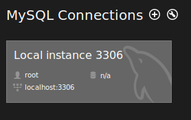
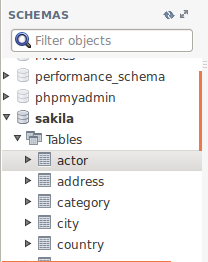
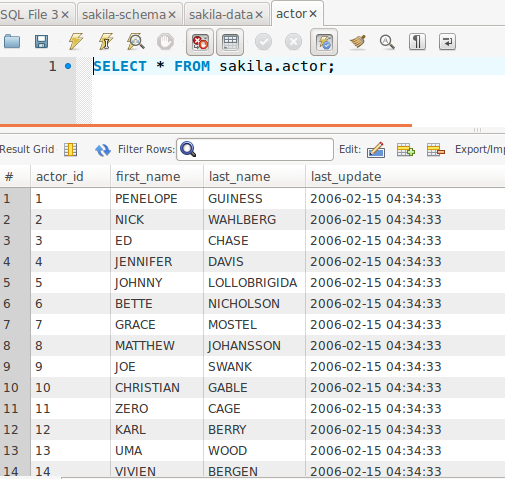
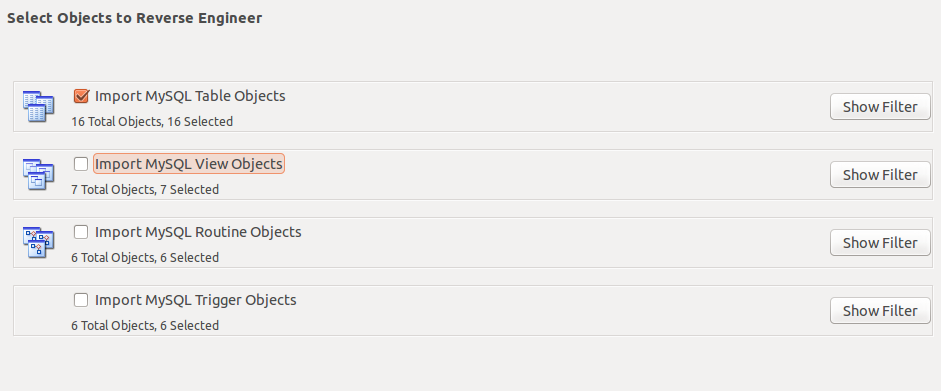

This lab is designed to be worked on during class time in a collaborative environment in which you each help one another. We have very different levels of technical expertise in the class, and it is important to work together on the labs to help one another in a classroom environment.  While you may be able to complete the work at home by yourself, in doing so you will be robbing your classmates of your expertise.  I will consider helping behaviors during the class as part of the participation component of the class. 

Also, keep in mind that this is the first time we are doing this class. There could be errors!  Raise your hand or talk to your neighbor if you are having problems. I welcome pull requests from students to be able to make improvements to the classes.

Finally, while you are welcome to work together, each person must INDIVIDUALLY complete and turn in the assignment. These are skills that must be practiced in order to be acquired. 

##*PLEASE TURN IN A FILE THAT INCLUDES YOUR ANSWERS TO THE QUESTIONS BELOW.*

##OVERVIEW

Databases are a tremendously useful too to be able manage data at scale.  In some cases, logic that would take hours to run through a program (or not be able to run) in a statistical package such as R can run in just minutes through a database.  


###MySQL Workbench
[MySQL workbench](http://www.mysql.com/products/workbench/) is a powerful tool to be able to create [entity relationship diagrams](http://en.wikipedia.org/wiki/Entity–relationship_model) which model relationships between tables.

Launch the MySQL workbench now (it is the dophin on the left menu bar).


### Load the sakila database schema (table structure) and data

From the main MySQL workbench page, click where it says "local connnection."



The password for the mysql root user is `password`.

Select *File->Open SQL Script* and select the `/labs/1_relational_databases/dakila-schema.sql` file.  Then press the lightning bolt  to execute the query. 

On the left side of the screen under schema press *refresh* and the schema sakila should show up. You have now loaded the database table structure. Now lets add some data do it.

Select *File->Open SQL Script* and select the `/labs/1_relational_databases/dakila-data.sql` file.  Then press the lightning bold to execute the query. 

Nice job. Your tables now have data. Don't you? Let's check to make sure.


### Browsing tables and data
Click on the refresh  and the sakila database should appear. Expand and right click on the actor table and select *Select rows - limit 1000*. 


 
If you got a result like below that is a good sign.




###1. Take a look at the address, city, and country tables.  Write out the relateionships in plain english. What keys connect them.


##Entity Relationship Diagrams

 In analytics based exercises, you may not have access to the origional data model, but in many cases the naming convention or explicit foreign key relationships within the tables will allow you to reverse engineer a model.  This won't always work, but it will work in this sample.*
*In our sample database all foreign keys have been explicitly identified.


###Reverse Engineering

On the top left of the screen click back on the home sign and you will be back on the main sign in page. Click the plus next to the models . Then select from the menu *Database->Reverse Engineer*.

Enter your password and press next until it gets to the portion where you are to select the models to be imported. Uncheck all but the first set of objects and then press execute.

This will create the entity relationship diagram (ERD) .  Open the ERD and 

###2. Take a look at the ERD and select 4 tables that are connected in some fashion. Write out the relateionships in plain english. What keys connect them.

###Designed Model

Open up the model file `/labs/1_relational_databases/sakila.mwb`.  

###3. Take a look at the provided file and compare it with the reverse engineered file.  What are the advantages of the provided file?

##SQL Queries

###4. Complete SQL calls from the following requests.

a. What are the names of all the languages in the database (sorted alphabetically)?

b. Return the full names (first and last) of actors with `SON` in their last name, ordered by their first name.

c. Find all the addresses where the second address is not empty (i.e., contains some text), and return these second addresses sorted.

d. Return the first and last names of actors who played in a film involving a Crocodile and a “Shark”, along with the release year of the movie, sorted by the actors’ last names.

e. How many films involve a `Crocodile` and a `Shark`?

f. Find all the film categories in which there are between 55 and 65 films. Return the names of these categories and the number of films per category, sorted by the number of films.

g. In how many film categories is the average difference between the film replacement cost and the rental rate larger than 17?

h. Find the address district(s) name(s) such that the minimal postal code in the district(s) is maximal over all the districts. Make sure your query ignores empty postal codes and district names.

i. Find the names (first and last) of all the actors and costumers whose first name is the same as the first name of the actor with ID 8. Do not return the actor with ID 8 himself. Note that you cannot use the name of the actor with ID 8 as a constant (only the ID). There is more than one way to solve this question, but you need to provide only one solution.


##ACCESS DATA WITH R

The code below can be run by highlighting it. 

 
```{r}
#This installs the MySQL driver it only neeeds to be run once.
#install.packages('RMySQL', type="source")

#This loads the library for use by subsequent lines of the script.
library('RMySQL')
#Documentation
#http://rss.acs.unt.edu/Rdoc/library/RMySQL/html/RMySQL-package.html 
#Note you might have to rerun this connection code if it gets disconnected. 
con <- dbConnect(MySQL(),
                 user="root", password="password",
                 dbname="sakila", host="localhost")
on.exit(dbDisconnect(con))

# List tables and fields in a table:
dbListTables(con)
dbListFields(con, "actor")

#Method 1 Dump the enitire table into a data.frame. 
data1 <- dbReadTable(con, "actor")

#Method 2 Run an arbitrary SQL statement and extract all its output (returns a data frame):
data2<- dbGetQuery(con, "select * from actor;")

#Method 3 Run an SQL statement and extract its output in pieces (returns a result set).  
#(this could be useful for a very big table):
rs <- dbSendQuery(con, "Select * from actor;")
data3 <- fetch(rs, n=1000)

dbDisconnect(con)
#Show the name of a data frame
names(data1)

#show the first few records of a dataset
head(data1)
```

###5.Provide the commands to execute the query for the answer to 4a.  

###6. How is the data stored internally in R after execution of an SQL statement?

#CHALLENGE GROUP PROBLEM
Much of the class has a background in databases so taht this exercise won't provide an extensive challenge.  As part of a challenge problem I'd like to start tackling a much larger dataset in the movie space: [IMDB](http://www.imdb.com/).  I can't require this of everyone in the class, but it is a great opportunity to learn and grow. 

This dataset is much larger and not nearly as easy to work with as the provided database. This likely represents the types of challenges you are more likely to deal with in the real world. 

The data is made available and can be downloaded and analyzed:
[http://www.imdb.com/interfaces](http://www.imdb.com/interfaces)

1. Use [Filezilla](https://filezilla-project.org/) to download the data from the FTP server. 
2. unzip the files. gzip -d *.gz

From here there are multiple different ways to go. You could read files into r and do matching from there.  You could create a database using something like this:
(I havne't tried this yet.)
https://github.com/ameerkat/imdb-to-sql 

Deliverable pull data from several of the different files to show that you can match them. Commit your answers as a pull request in the challenge problems.


