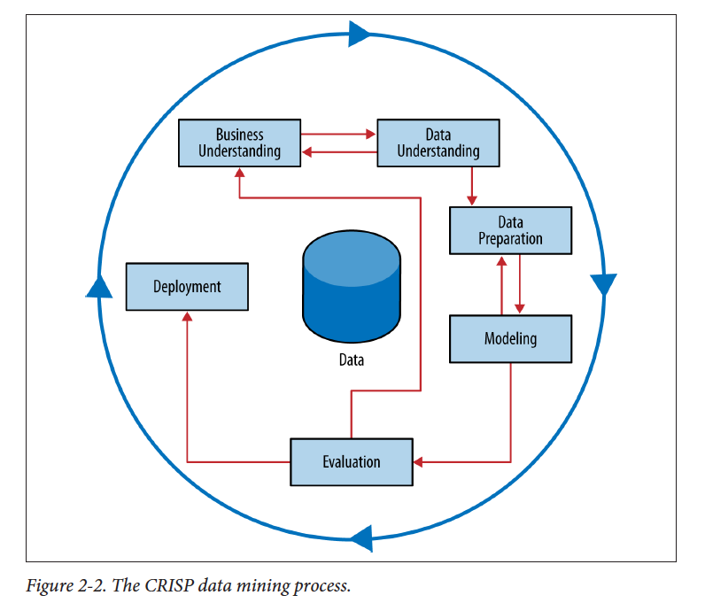

#Technology Fundamentals for Analytics 2014 
##(MGMT-6963-01)

---
#Lab

#Classification is a critical analytical process used in many different contexts:
1. Classify customers to determine specific marketing message.
2. Classify voters to decide weather to contact, mail, or phone.
3. Classify species by specific characteristics (IRIS)


---

#The Iris Data 

---

#Fisher's Iris data set is a multivariate data set introduced by Sir Ronald Fisher (1936) as an example of discriminant analysis. *Predicted attribute: class of iris plant.* 

---
#https://archive.ics.uci.edu/ml/datasets/Iris 

---


---
#How would you approach this problem?


---


---
#Stages of Model Development 
*Pay attention we will use this as a framework*
1. Data understanding
2. Data preparation
3. Modeling
4. Evaluation
5. Deployment (DDD)
5. Business Understanding

---

#The data is included with R, so we just have to call it.  Some of these exercises come from this document. 
### (See Section 1.3)  http://cran.r-project.org/doc/contrib/Zhao_R_and_data_mining.pdf 


---
#Data Understanding
```{r}
iris<-iris
View(iris)
summary (iris)
str(iris)
```
---

#Data Understanding
```{r}
hist(iris$Sepal.Length)
plot(density(iris$Sepal.Length))
pie(table(iris$Species))
cor(iris[,1:4])
aggregate(Sepal.Length ~ Species, summary, data=iris)
boxplot(Sepal.Length~Species, data=iris)
install.packages("scatterplot3d")
library(scatterplot3d)
scatterplot3d(iris$Petal.Width, iris$Sepal.Length, iris$Sepal.Width)
install.packages("scatterplot3d")
library(MASS)
parcoord(iris[1:4], col=iris$Species)
```
---
#Data Understanding
```{r}
install.packages("ggplot2")
library(ggplot2)
qplot(Sepal.Length, Sepal.Width, data=iris, facets=Species ~.)
```

---
##1. Describe what you find through visualizing the data. What intuition would a classifier have to capture to categorize the data?

---
#What is it called when we pull out 50% of the data for training?

---
# (from last week) Titanic: Data Modeling and Evaluation (Cross Validation)
1. Holdout Sample (2-fold cross validation) (large datasets)

---
#This creates a vector indicator we will use to select our training and test dataset 
```{r}
set.seed(1234)

ind <- sample(2, nrow(iris), replace=TRUE, prob=c(0.5, 0.5))
#Select our training data
trainData <- iris[ind==1,]
#Select our test data
testData <- iris[ind==2,]
```
---
#Decisions trees help with selecting the variable at each step that best splits the data, and then the specific criteria. 
1. There are different methods for each, and select is relevant.
2. The PARTY and RCART packages provide a way of completing this in R.

---
#This is a package that includes a decision Tree 
```{r}
install.packages('party')
library(party)
#This specifies the forula
myFormula <- Species ~ Sepal.Length + Sepal.Width + Petal.Length + Petal.Width
#This generates the decision tree
iris_ctree <- ctree(myFormula, data=trainData)
```

---
#How did we do in the training dataset?  
```{r}
trainData$pred_ctree<-predict(iris_ctree)
plot(iris_ctree)

table(trainData$pred_ctree, trainData$Species)
trainData$correct<-ifelse(trainData$pred_ctree==trainData$Species, 1, 0)

#This shows the percentage of the data correctly predicted.
summary(trainData$correct)
```

---
##2. Which class was most likely to be misclassified?  How many total were misclassified?
##3. Explain the logic found in the first node of the decision tree.    
##4. Rerun the analysis using only 20% of the data as a training.  What % is correct?

---
#How did we do in the test dataset?  
```{r}
testData$pred_ctree <- predict(iris_ctree, newdata = testData)
testData$correct<-ifelse(testData$pred_ctree==testData$Species, 1, 0)
```

---
##5 What % of the predictions are correct in the test data?
##6 Would you expect the % classified correctly to be higher in the training or test analysis?


---
#There are lots of different algoritms we could use to select the feature order and then set the amount.  However, the creation of the right tree from the data could require substancial experimentation and tuning of algorithms to see how the different trees created by the different algorithms perform.


---
#What if we created a forest rather than a tree and systematically tested the performance of each tree?


---
#Random Forest
---
#Random forests are an ensemble learning method for classification (and regression) that operate by constructing a multitude of decision trees at training time and outputting the class that is the mode of the classes output by individual trees.

---
#*Tree bagging* repeatedly selects a bootstrap sample of the training set and fits trees to these samples.  Outputs are averaged.

---
#*Random forests* use bootstrap methods of tree bagging with a modified tree learning algorithm that selects, at each candidate split in the learning process, a random subset of the features. 

---
#Random Forests
```{r}
install.packages('randomForest')
library('randomForest')
rf <- randomForest(Species ~ ., data=trainData, ntree=100, proximity=TRUE)
trainData$pred_rf<-predict(rf)
table(trainData$pred_rf, trainData$Species)
print(rf) 
plot(rf)
importance(rf)
```

---
#Gini importance Every time a split of a node is made on variable m the gini impurity criterion for the two descendent nodes is less than the parent node. Adding up the gini decreases for each individual variable over all trees in the forest gives a fast variable importance that is often very consistent with the permutation importance measure.

---
#Support Vector Machines

---
#In machine learning, support vector machines (SVMs, also support vector networks[1]) are supervised learning models with associated learning algorithms that analyze data and recognize patterns, used for classification and regression analysis. 

---


---


---

#Support Vector Machines
###Kernel-based machine learning methods for classification, regression, clustering, novelty detection, quantile regression and dimensionality reduction. Among other methods kernlab includes Support Vector Machines, Spectral Clustering, Kernel PCA, Gaussian Processes and a QP solver.

```{r}
library(kernlab)
#Next, we create a radial basis function (RBF) that will be used during training.  This will be used as the kernel function.
rbf <- rbfdot(sigma=0.1)
irisSVM <- ksvm(species~.,data=irisdata[irisTrainData,],type="C-bsvc",kernel=rbf,C=10,prob.model=TRUE)
fitted(irisSVM)

predict(irisSVM, irisdata[irisValData,-5], type="probabilities")
```
---
#Neural Networks

---
##In machine learning and related fields, artificial neural networks (ANNs) are computational models inspired by an animal's central nervous systems (in particular the brain) which is capable of machine learning as well as pattern recognition. Artificial neural networks are generally presented as systems of interconnected "neurons" which can compute values from inputs.

---
#Perhaps the greatest advantage of ANNs is their ability to be used as an arbitrary function approximation mechanism that 'learns' from observed data.
---


---
# library(nnet) - Software for feed-forward neural networks with a single hidden layer, and for multinomial log-linear models.

---
#Neural Network with 2 Hidden Layers
 

---
#Neural Networks Example
```{r}
library(nnet)
#The neural network requires that the species be normalized using one-of-n normalization. We will normalize between 0 and 1.  This can be done with the following command.
ideal <- class.ind(irisdata$species)

#We can now train a neural network for the training data.
irisANN = nnet(irisdata[irisTrainData,-5], ideal[irisTrainData,], size=10, softmax=TRUE)

#Now we can test the output from the neural network.
predict(irisANN, irisdata[irisValData,-5], type="class")

##7 Calculate the % classified correctly in the random forest, SVM, and NN prediction for both the training and the test set.  


#K-means Clustering
---
##It could be useful to visualize and see these differences. 

```{r}
iris2 <- iris[,1:4]
kmeans<- kmeans(iris2, 3)
iris$cluster<-kmeans$cluster
plot(iris2[c("Sepal.Length", "Sepal.Width")], col = kmeans$cluster)
points(kmeans$centers[,c("Sepal.Length", "Sepal.Width")], col=1:3, pch=8, cex=2)
table(iris$cluster, iris$Species)

```

---

##The commands PAM and PAMK are two alternate clustering algorithms.
 
```{r}
install.packages('fpc')
library('fpc')
pamk <- pamk(iris2, 3)
pam <- pam(iris2, 3)
```

---
#Regression

---
#When do we use regression?

---
#In statistics, regression analysis is a statistical process for estimating the relationships among variables. It includes many techniques for modeling and analyzing several variables, when the focus is on the relationship between a dependent variable and one or more independent variables. 

---


---

#[Boston Housing dataset](https://archive.ics.uci.edu/ml/datasets/Housing)

---
#Regression Example - Data Understanding
```{r}
install.packages('mlbench')
library(mlbench)
#http://rss.acs.unt.edu/Rdoc/library/mlbench/html/BostonHousing.html 
data(BostonHousing)
summary(BostonHousing$medv)
```

---
#Regression Example - Model
```{r}
lm.fit <- lm(medv ~ ., data=BostonHousing)

lm.predict <- predict(lm.fit)
summary(lm.fit)
#mean=22.53
mean(BostonHousing$medv)
```

---
#Regression Example - Evaluation
```{r}
# mean squared error: 21.89483
mean((lm.predict - BostonHousing$medv)^2) 

#This manually calcuates the R2
1-sum((lm.predict - BostonHousing$medv)^2)/sum((BostonHousing$medv-mean(BostonHousing$medv))^2)

plot(BostonHousing$medv, lm.predict,
     main="Linear regression predictions vs actual",
     xlab="Actual")
```

---
Neural Networks can similarly be used. 

install.packages('nnet')
require(nnet)
```{r}
# scale inputs: divide by 50 to get 0-1 range
nnet.fit <- nnet(medv/50 ~ ., data=BostonHousing, size=2) 
summary(nnet.fit)
# multiply 50 to restore original scale
nnet.predict <- predict(nnet.fit)*50 

# mean squared error: 16.40581
mean((nnet.predict - BostonHousing$medv)^2) 


plot(BostonHousing$medv, nnet.predict,
     main="Neural network predictions vs actual",
     xlab="Actual")
```


#11  Calculate the R2 that results from the nnet prediction.  

#12 Is the nnet prediction better or worse than the regression result?
#Why?

---

#Classification Algorithms  
###Logistic regression: no distribution requirement, perform well with few categories categorical variables, compute the logistic distribution, good for few categories variables, easy to interpret, compute CI, suffer multicollinearity

###Decision Trees: no distribution requirement, heuristic, good for few categories variables, not suffer multicollinearity (by choosing one of them)

---
#Classification Algorithms
###NB: generally no requirements,  good for few categories variables, compute the multiplication of independent distributions, suffer multicollinearity

###LDA(Linear discriminant analysis not latent Dirichlet allocation): require normal, not good for few categories variables, compute the addition of Multivariate distribution, compute CI, suffer multicollinearity

---
#Classification Algorithms
###SVM:  no distribution requirement, compute hinge loss, flexible selection of kernels for nonlinear correlation, not suffer multicollinearity, hard to interpret

###Lasso: no distribution requirement, compute L1 loss, variable selection, suffer multicollinearity

---
#Classification Algorithms
###Ridge:  no distribution requirement, compute L2 loss, no variable selection, not suffer multicollinearity

###Bagging, boosting, ensemble methods(RF, Ada, etc): generally outperform single algorithm listed above.
---
etc. etc. 


