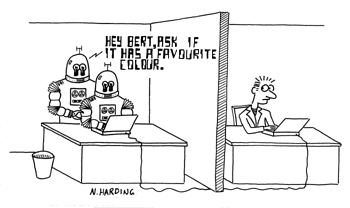
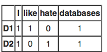
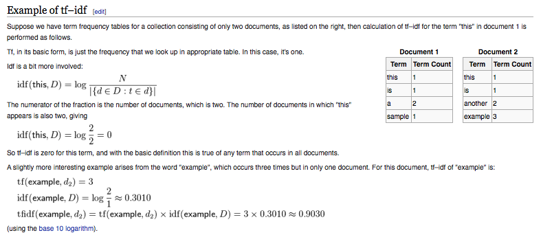

#**Technology Fundamentals for Analytics Lab**
##Jason Kuruzovich
---


#Agenda
Introduction to Text Analysis


---



---

#The Turing test is a test of a machine's ability to exhibit intelligent behavior equivalent to, or indistinguishable from, that of a human.

---


---


---

#Text is knowlege, and knowlege can answer questions.
---


---


---
#Big Data Problem: Could Fake Reviews Kill Amazon?

---


http://www.datasciencecentral.com/profiles/blogs/could-fake-reviews-kill-amazon

---

#Cross Industry Standard Process for Data Mining (CRISP-DM; Shearer, 2000),

---
#Stages of Model Development 
*Pay attention we will use this as a framework*
1. Data understanding
2. Data preparation
3. Modeling
4. Evaluation
5. Deployment (DDD)
5. Business Understanding

----
#1. Data Understanding 
-A text mining analyst typically starts with a set of highly heterogeneous input texts. 
-How is the text formatted?  
-What types of text data is present? 
-What should be removed because it is irrelevant?
-What types of analyses are likely to be useful?

----
#2. Data preparation
- Stopword removal 
- Stemming procedures
- Lemmatisation
- (misc) Remove whitespace, Remove punctuation
- Creation of Corpus
- Create Term Document Matrix
- Create N-gram features
- tf-idf

----

#Stop Words
In computing, stop words are words which are filtered out before or after processing of natural language data (text). 
There is not one definite list of stop words which all tools use and such a filter is not always used. Some tools specifically avoid removing them to support phrase search.


---
####["a","able","about","above","abst","accordance","according","accordingly","across","act","actually", "added","adj","adopted","affected","affecting","affects","after","afterwards","again","against","ah","all", "almost","alone","along","already","also","although","always","am","among","amongst","an","and","announce", "another","any","anybody","anyhow","anymore","anyone","anything","anyway","anyways","anywhere", "apparently","approximately","are","aren","arent","arise","around","as","aside","ask","asking","at","auth", "available","away","awfully","b","back","be","became","because","become","becomes","becoming","been", "before","beforehand","begin","beginning","beginnings","begins","behind","being","believe","below","beside", "besides","between","beyond","biol","both","brief","briefly","but","by","c","ca","came","can","cannot","can't", "cause","causes","certain","certainly","co","com","come","comes","contain","containing","contains","could", "couldnt","d","date","did","didn't","different","do","does","doesn't","doing","done","don't","down","downwards", "due","during","e","each","ed","edu","effect","eg","eight","eighty","either","else","elsewhere","end","ending", "enough","especially","et","et-al","etc","even","ever","every","everybody","everyone","everything","everywhere","ex","except","f", "far","few","ff","fifth","first","five","fix","followed","following","follows","for","former","formerly","forth","found", "four","from","further","furthermore","g","gave","get","gets","getting","give","given","gives","giving","go","goes", "gone","got","gotten","h","had","happens","hardly","has","hasn't","have","haven't","having","he","hed","hence", "her","here","hereafter","hereby","herein","heres","hereupon","hers","herself","hes","hi","hid","him","himself","his", "hither","home","how","howbeit","however","hundred","i","id","ie","if","i'll","im","immediate","immediately", "importance","important","in","inc","indeed","index","information","instead","into","invention","inward","is","isn't", "it","itd","it'll","its","itself","i've","j","just","k","keep"," keeps","kept","keys","kg","km","know","known","knows","l","largely","last","lately","later","latter","latterly", "least","less","lest","let","lets","like","liked","likely","line","little","'ll","look","looking","looks","ltd","m","made", "mainly","make","makes","many","may","maybe","me","mean","means","meantime","meanwhile","merely","mg", "might","million","miss","ml","more","moreover","most","mostly","mr","mrs","much","mug","must","my","myself","n", "na","name","namely","nay","nd","near","nearly","necessarily","necessary","need","needs","neither","never", "nevertheless","new","next","nine","ninety","no","nobody","non","none","nonetheless","noone","nor","normally", "nos","not","noted","nothing","now","nowhere","o","obtain","obtained","obviously","of","off","often","oh","ok", "okay","old","omitted","on","once","one","ones","only","onto","or","ord","other","others","otherwise","ought", "our","ours","ourselves","out","outside","over","overall","owing","own","p","page","pages","part","particular", "particularly","past","per","perhaps","placed","please","plus","poorly","possible","possibly","potentially","pp", "predominantly","present","previously","primarily","probably","promptly","proud","provides","put","q","que", "quickly","quite","qv","r","ran","rather","rd","re","readily","really","recent","recently","ref","refs","regarding", "regardless","regards","related","relatively","research","respectively","resulted","resulting","results","right","run", "s","said","same","saw","say","saying","says","sec","section","see","seeing","seem","seemed","seeming","seems", "seen","self","selves","sent","seven","several","shall","she","shed","she'll","shes","should","shouldn't","show", "showed","shown","showns","shows","significant","significantly","similar","similarly","since","six","slightly","so", "some","somebody","somehow","someone","somethan","something","sometime","sometimes","somewhat", "somewhere","soon","sorry","specifically","specified","specify","specifying","state","states","still","stop", "strongly","sub","substantially","successfully","such","sufficiently","suggest","sup","sure"," t","take","taken","taking","tell","tends","th","than","thank","thanks","thanx","that","that'll","thats","that've", "the","their","theirs","them","themselves","then","thence","there","thereafter","thereby","thered","therefore", "therein","there'll","thereof","therere","theres","thereto","thereupon","there've","these","they","theyd","they'll", "theyre","they've","think","this","those","thou","though","thoughh","thousand","throug","through","throughout", "thru","thus","til","tip","to","together","too","took","toward","towards","tried","tries","truly","try","trying","ts", "twice","two","u","un","under","unfortunately","unless","unlike","unlikely","until","unto","up","upon","ups","us", "use","used","useful","usefully","usefulness","uses","using","usually","v","value","various","'ve","very","via","viz", "vol","vols","vs","w","want","wants","was","wasn't","way","we","wed","welcome","we'll","went","were","weren't", "we've","what","whatever","what'll","whats","when","whence","whenever","where","whereafter","whereas", "whereby","wherein","wheres","whereupon","wherever","whether","which","while","whim","whither","who", "whod","whoever","whole","who'll","whom","whomever","whos"]
https://github.com/arc12/Text-Mining-Weak-Signals/wiki/Standard-set-of-english-stopwords 

---

#Stemming
Stemming is the term used in linguistic morphology and information retrieval to describe the process for reducing inflected (or sometimes derived) words to their word stem, base or root form—generally a written word form.

---


----
#Lemmatisation (or lemmatization) 

Lemmatisation in linguistics is the process of grouping together the different inflected forms of a word so they can be analysed as a single item.

For example, in English, run, runs, ran, and running all correspond to the lemma run. 

---

#Text Corpus
In linguistics, a corpus (plural corpora) or text corpus is a large and structured set of texts (nowadays usually electronically stored and processed). They are used to do statistical analysis and hypothesis testing, checking occurrences or validating linguistic rules within a specific language territory.

---
A document-term matrix or term-document matrix is a mathematical matrix that describes the frequency of terms that occur in a collection of documents. In a document-term matrix, rows correspond to documents in the collection and columns correspond to terms

D1 = "I like databases"
D2 = "I hate databases",
then the document-term matrix would be:

---


---
N-gram
In the fields of computational linguistics and probability, an n-gram is a contiguous sequence of n items from a given sequence of text or speech. The items can be phonemes, syllables, letters, words or base pairs according to the application. The n-grams typically are collected from a text or speech corpus.

---


---
#Google N-grams
#The following is an example of the 4-gram data in this corpus:

serve as the incoming 92
serve as the incubator 99
serve as the independent 794
serve as the index 223
[Google gives n-gram](http://googleresearch.blogspot.com/2006/08/all-our-n-gram-are-belong-to-you.html)

----
#tf–idf
Short for term frequency–inverse document frequency, is a numerical statistic that is intended to reflect how important a word is to a document in a collection or corpus.

It is often used as a weighting factor in information retrieval and text mining. The tf-idf value increases proportionally to the number of times a word appears in the document, but is offset by the frequency of the word in the corpus, which helps to control for the fact that some words are generally more common than others.

---

##tf = frequency of count


---


---


#Sample Text Corpus
##Text annotations can enable reasoning engines
####http://www.nactem.ac.uk/resources.php

----
#[Fit]Text Processing with R 

----
#[Fit]Data Preparation 
#[Fit]OLD SCHOOL 
##With gsub and regular expressions 

 
----
#Processing Text with gsub 

```{R} 
# Remove specific reference
 tweets.text <- gsub("rt", "", tweets.text)

 # Replace @UserName
 tweets.text <- gsub("@\\w+", "", tweets.text)

 # Remove punctuation
 tweets.text <- gsub("[[:punct:]]", "", tweets.text)

 # Remove links
 tweets.text <- gsub("http\\w+", "", tweets.text)
```

----
#Processing Text with gsub 

```{R} 
 # Remove tabs
 tweets.text <- gsub("[ |\t]{2,}", "", tweets.text)

 # Remove blank spaces at the beginning
 tweets.text <- gsub("^ ", "", tweets.text)

# Remove blank spaces at the end
 tweets.text <- gsub(" $", "", tweets.text)
```
----

#[Fit]Data Preparation 
#[Fit]NEW SCHOOL 
##With tm_map

----
#Processing Text with tm_map

```{R} 
# Pull down a webpage
u = "http://cran.r-project.org/web/packages/available_packages_by_date.html"

# Read in an HTML Table
t = readHTMLTable(u)[[1]]

# Change to a corpus
ap.corpus <- Corpus(DataframeSource(data.frame(as.character(t[,3]))))

# Remove Punctuation
ap.corpus <- tm_map(ap.corpus, removePunctuation)

```

----
#Processing Text with tm_map

```{R} 

#Change to lower case
ap.corpus <- tm_map(ap.corpus, tolower)

#Remove stopwords
ap.corpus <- tm_map(ap.corpus, function(x) removeWords(x, stopwords("english")))

#Add Custom stop words. 
ap.corpus <-tm_map(ap.corpus, removeWords, c(stopwords("english"),"my","custom","words"))

## create a term document matrix
dtm <- DocumentTermMatrix(ap.corpus) 
```

---
#More Data from the Text - package Sentiment
1. classify_emotion
This function helps us to analyze some text and classify it in different types of emotion: anger, disgust, fear, joy, sadness, and surprise. The classification can be performed using two algorithms: one is a naive Bayes classifier trained on Carlo Strapparava and Alessandro Valitutti’s emotions lexicon; the other one is just a simple voter procedure.

2. classify_polarity
In contrast to the classification of emotions, the classify_polarity function allows us to classify some text as positive or negative. In this case, the classification can be done by using a naive Bayes algorithm trained on Janyce Wiebe’s subjectivity lexicon; or by a simple voter algorithm.


---
#Kaggle2 - Pizza 
1. Clean and prepare text
2. Use Word cloud to identify frequently occurring variables.
3. Code the appearance of specific words to relate to specific constructs. 
4. Calculate Sentiment.  
5. Visualize relationships
6. Model Relationships

---
#Remove some common terms. 

```{R}
c = Corpus(VectorSource(req))
c_clean = tm_map(c, removeWords, c(stopwords('SMART'), 'pizza', 'pizzas', 'request', 'requests'))
c_clean = tm_map(c_clean, rm_space)
```

--

---
#Combine similar concepts. 

```{R}
money = ' money| now| broke| week| until| time| last|day| when| paid| next| first|night| 
after| tomorrow| month| while| account| before| long| rent| buy| bank| still| bill| ago| cash| due|
 soon| past| never|check| spent| year| poor| till| morning| dollar| financial| hour| evening| credit| budget|
 loan| buck| deposit| current| pay'
job = ' work| job|check|employ| interview| fire| hire'
student = ' college| student| school| roommate| study| university| final| semester| class|
 project| dorm| tuition'
family = ' family| mom| wife| parent| mother| husband| dad| son| daughter| father| mum'
craving = ' friend| girlfriend| crave| craving| birthday| boyfriend| celebrat| party| parties|
 game| movie| film| date| drunk| beer| invite| drink| waste'
```

---


---
#Beyond the Basics with APIs
Sentiment analysis (also known as opinion mining) refers to the use of natural language processing, text analysis and computational linguistics to identify and extract subjective information in source materials.

Generally speaking, sentiment analysis aims to determine the attitude of a speaker or a writer with respect to some topic or the overall contextual polarity of a document. 


-----

#Sentiment Analysis 
[http://www.alchemyapi.com/api/entity/sentiment.html](http://www.alchemyapi.com/api/entity/sentiment.html)

-----
#Sentiment
http://www.alchemyapi.com/products/demo/

http://www.alchemyapi.com/products/demo/alchemylanguage/


---
#[FIT] Where to go from Here 

---
#Where to go from Here 
- Coursera NLP
https://www.coursera.org/course/nlp

- Text Processing with Python
http://www.nltk.org/book/

- Text Mining with R 
http://www.jstatsoft.org/v25/i05/paper 

- TM_map
http://cran.r-project.org/web/packages/tm/tm.pdf

- Python NLP in humanities
http://fbkarsdorp.github.io/python-course/


Questions.
1.  Find a unique text corpus on the web and describe its properties.

2.  Run the following line by line so you can inspect the changing corpus.  Then adjust the maximum words to 100 and List 5 of the terms that occur with moderate frequency.

```{R}
require(XML)
require(tm)
require(wordcloud)
require(RColorBrewer)
u = "http://cran.r-project.org/web/packages/available_packages_by_date.html"
t = readHTMLTable(u)[[1]]
ap.corpus <- Corpus(DataframeSource(data.frame(as.character(t[,3]))))
inspect(ap.corpus[1:4])
ap.corpus <- tm_map(ap.corpus, removePunctuation)
inspect(ap.corpus[1:4])
ap.corpus <- tm_map(ap.corpus, tolower)
inspect(ap.corpus[1:4])
ap.corpus <- tm_map(ap.corpus, function(x) removeWords(x, stopwords("english")))
inspect(ap.corpus[1:4])
ap.tdm <- TermDocumentMatrix(ap.corpus)
ap.m <- as.matrix(ap.tdm)
ap.v <- sort(rowSums(ap.m),decreasing=TRUE)
ap.d <- data.frame(word = names(ap.v),freq=ap.v)
table(ap.d$freq)
pal2 <- brewer.pal(8,"Dark2")
png("wordcloud_packages.png", width=1280,height=800)
wordcloud(ap.d$word,ap.d$freq, scale=c(8,.2),min.freq=3,
          max.words=Inf, random.order=FALSE, rot.per=.15, colors=pal2)
dev.off()
```

3.  For the code above, describe what the ap.tdm.  What does it consist of?  

4. Which text from the Kaggle2 assignment promises to provide features?  Describe the steps that the solution Runze used in feature creation. 


