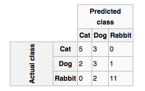
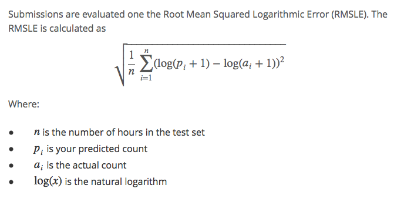
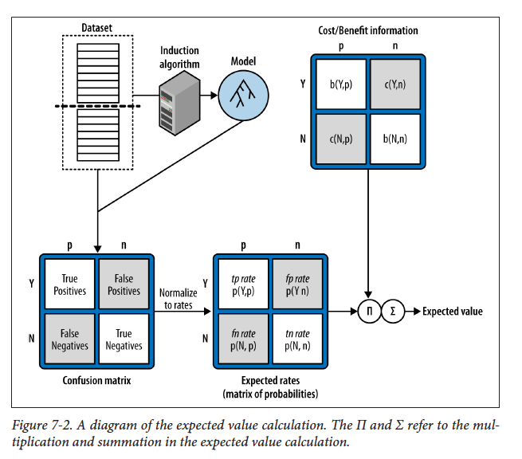
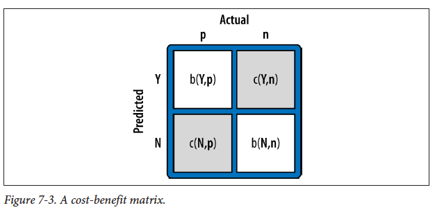
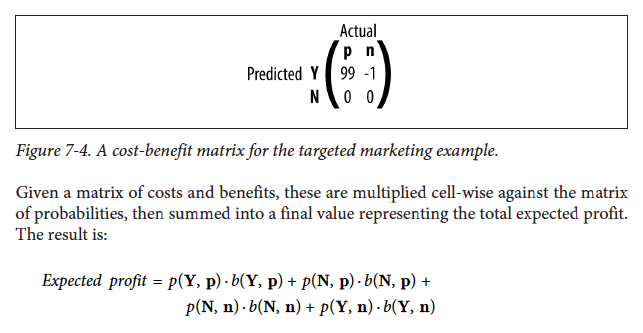

#**Technology Fundamentals for Analytics Lab**
##Jason Kuruzovich
---

#Agenda
1. Exam Details
2. Guest Speaker  NICK ELPRIN   Founder http://www.dominodatalab.com
3. Kaggle Details [Presentation]
4. Evaluating Models
5. Deploying Models [Cases Chequed.com and iNovum.]

---
#Nick Elprin
##[http://www.dominodatalab.com](http://www.dominodatalab.com)
##Domino Data Lab, Inc. is a new company that started out with a focus on enabling much easier cloud computation, and doing “version control for data science.”

----
#Exam Details
- You should be able to go from statement to R code.  You can use a 1 page both sides cheat sheet.
- You should be able to go from R code to a statement describing what it does. 
- You should have conceptual knowledge of Hadoop and Mapreduce [not specific syntax].
- You should be able to understand deployment of models for cost benefit analysis.

---
#Kaggle
#Cross Industry Standard Process for Data Mining (CRISP-DM; Shearer, 2000),

---

#Cross Industry Standard Process for Data Mining (CRISP-DM; Shearer, 2000),

---
#Stages of Model Development 
*Pay attention we will use this as a framework*
1. Data understanding
2. Data preparation
3. Modeling
4. Evaluation `<- Focus today`
5. Deployment (DDD)  `<- Focus today`
5. Business Understanding

----
#What is a good model?

----
#What is a good model?
1. Predicts on data that the model has not been trained on.
(This indicates that overfitting is not likely an issue).

2. Minimizes errors (classification or prediction)

3. (maybe) Understandible/parsimonious

---
#Evaluation

----
#What is a good model?

##Classification
- Accuracy = Number of correct decisions/Total number of decisions

##Prediction (Continuous DV)
- Root-mean-square error (RMSE)
- Root Mean Squared Logarithmic Error (RMSLE)
- Coefficient of Determination (R2)

----
#Classification Accuracy
##Confusion Matrix

---
#Prediction (Continuous DV)
##Root-mean-square error (RMSE)

---
#Prediction (Continuous DV)
##Root Mean Squared Logarithmic Error (RMSLE)

---
#Prediction (Continuous DV)
##Coefficient of Determination (R2)
 

---
#What if one class is prevalent?
- Example, Fraud occurs in less than 1/100.  

#What if there is Unequal Costs and Benefits
- Difference between a false positive and a false negative.

---
#Example Model Valuation Chequed.com

---
#HR Analytics Background - Survey Based methods
1. Multiple measures per construct
2. Data reduction
3. Regression
4. Deploy to predict job success 

---
#1. Multiple measures per construct.
##Example
Neuroticism is a fundamental personality trait in the study of psychology characterized by anxiety, fear, moodiness, worry, envy, frustration, jealousy, and loneliness.

---
#1. Multiple measures per construct.
##Construct = Neuroticism Part of Big 5
I am not a worrier.
I am seldom sad or depressed.
I often feel helpless and want someone else to solve my problems.
At times I have been so ashamed I just wanted to hide.
I often feel inferior to others.
When I'm under a great deal of stress, sometimes I feel like I'm going to pieces.
I rarely feel lonely and blue.
I often feel tense and jittery.
Sometimes I feel completely worthless.
I rarely feel fearful or anxious.
I often get angry at the way people treat me.
Too often, when things go wrong, I get discouraged and want to give up.

---
#1. Multiple measures per construct.
Survey on Likert Scale.

1. Strongly disagree
2. Disagree
3. Neither agree nor disagree
4. Agree
5. Strongly agree

---
#2. Average multiple measures from construct, reverse coding where necessary
- I rarely feel fearful or anxious. [6-Value]
- Too often, when things go wrong, I get discouraged and want to give up. [Value]

---
#3. Regression
- Regression using multiple constructs and a dependent variable likely to be context specific.

---
#4. Deploy to predict job success 
- Variables are weighted in relationship to significance

---
#HR Analytics DV - Ranking of salespeople
- We take our existing sales
- How might we evaluate the model?

---
#HR Analytics DV - Ranking of salespeople
1. R2 [Easy because is outcome of regression and fits with IO psychology
2. RMSE based on rank
3. Classify top 20%. Either individual is in top 20% or not. 
4. Classify in 5 different sections (0-20, 21-40, etc.)

----
#Deploying Model
----
#Deploying Model
How do you use the HR analytics?

---
#Chequed fit score from 1-5
[https://www.chequed.com/pre-employment-assessment-test/](https://www.chequed.com/pre-employment-assessment-test/)

---
#Take 5 minutes and find an example of a model deployed in the wild. 

---
#Examples

---
#Deploy - Classification
##Consider
- For this case study, let’s consider a real example of targeted marketing: targeting the best
prospects for a charity mailing.

[It costs $1 to print and send a brochure.  How might I improve the likelihood of a positive outcome?]

---
#Expected Value
- Expected Benefit = Pr(x) * Vr + [1 - Pr(x)] * Vnotr
 
----
#What business problem are we solving. 
##p(x)*$99 - [1-p(x)]*$1 >0.

----
#What other factors should be considered?

----
#What factors should be considered?
- Some people might give $1 others $1000. 
- There could be a negative cost of predicting wrong that differs depending

----

----

----
#While probability can be estimated from the data, cost benefit is a separate process.
##b(Y,p) and b(N, n) are the benefits of correct prediction.
##c(N,p) and c(Y, n) are the costs of an incorrect prediction.

----

----
#Share Examples on Progress with Kaggle 2

---
#Interesting Book Resources to Check Out
## Machine Learning for Hackers
[https://github.com/johnmyleswhite/ML_for_Hackers](https://github.com/johnmyleswhite/ML_for_Hackers)

----

