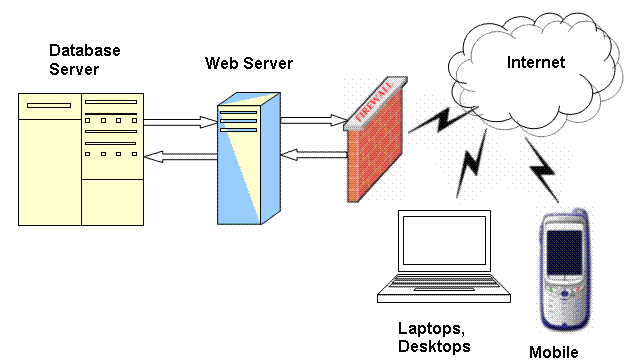

#**Technology Fundamentals for Analytics**
##Jason Kuruzovich
---

#Lab

---

---
#What are the objectives of transactional systems?

---
#Transactional systems have to ensure data represents reality

---
#How do transactional systems work with databases?
---

---
#Relationships Between Data
1. Relational View (Database)
2. Semantic/Object View [Later]

---
#Relational Databases

---
#[fit]SQL Examples

---
#Relational Databases

---
#Relational Databases
"A relational database is a database that stores information about both the data and how it is related. "In relational structuring, all data and relationships are represented in flat, two-dimensional table called a relation."[1] For example, organizations often want to store and retrieve information about people, where they are located and how to contact them. Often many people live or work at a variety of addresses. So, recording and retrieving them becomes important—relational databases are good for supporting these kinds of applications."
[*Source: Wikipedia*](http://en.wikipedia.org/wiki/Relational_database)

---

---
#Challenge Problem: IMBD

---
#What is a movie producer?

---
#**What might a movie producer be interested in predicting?**

---
#**How might standard deviation and mean both be relevant?**

---
#**What data is available the might be relevant?**

---
#**The Internet Movie Database**

---
#Lab on IMDB
1. Install Python.
[`https://www.python.org/downloads/`](https://www.python.org/downloads/)

2. Install SQLObject from command line.
`easy_install -U SQLObject`

3. Use Filezilla to download from [IMDB](http://www.imdb.com/interfaces)

4. gzip -d *.gz
https://github.com/ameerkat/imdb-to-sql 

5. ????

