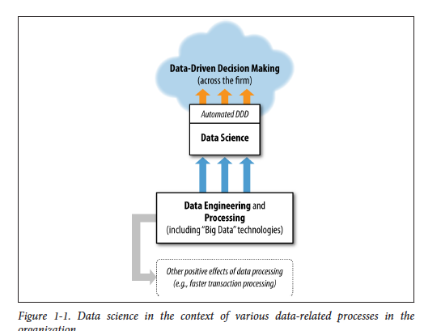

#**Technology Fundamentals for Analytics**
##Jason Kuruzovich
---


#Agenda
1. Continue presentation from last time
2. Nested relationships in databases and analytics
3. Introduction to relational databases
4. Movies

---


----
 
#Data science relies heavily on data engineering and processing.

---
#How does a data scientist approach a business problem?

---
#Data scientists decompose problems into subtasks that can be composted to solve the business problem. 

---
#What are some of the relevant subtasks?

---


---

#Cross Industry Standard Process for Data Mining (CRISP-DM; Shearer, 2000),

---
#Stages of Model Development 
*Pay attention we will use this as a framework*
1. Data understanding
2. Data preparation
3. Modeling
4. Evaluation
5. Deployment (DDD)
5. Business Understanding


----
# *Data understanding*


----
# What do we need to *understand* about the *data?*

----
#What do we need to understand about the data?
* Meaning: What is the definition of the data?  How can we understand what it means?
* Data types: What is the data structure? 
* Provenance: What has the history of the data been?
* Distribution: Mean, Standard Deviation, Correlations, Skewness, Entropy

----
#Data Types - Variables
* Binary: Of two different categories. 
* Nominal: Specific categories of data that don't have a natural ordering. Model of vehicle.
* Ordinal: Categories of data that have a natural ordering.  `Education (high school, Undergrad, Masters, PhD)`
* Interval: Natural split between the levels `Satisfation (Rate on a scale of 1-10 how satisfied you are.)`
* Ratio: Intervale data with a natural 0 point. 


----
#[Correlations](http://www.tylervigen.com)


----
##"Entropy is a measure of disorder that can be applied to a set, such as one of our individual segments. Consider that we have a set of properties of members of the set, and each member has one and only one of the properties. ... Disorder corresponds to how mixed (impure) the segment is with respect to these properties of interest. So, for example, a mixed up segment with lots of write-offs and lots of non-write-offs would have high entropy."

```entropy = - p1 log (p1) - p2 log (p2) - ⋯
```

----

##How do we understand the entropy among the *intelligent species* in the room?

----
#What would happen to any model predicting whether someone in the room is an alien.  


----
#Why is this relevant to creating a model?

----

#How would predicting a man vs. a woman be different?


----

#Among undergrads, is gender entropy higher or lower or same when comparing RPI vs. Harvard?


----
# *Data preparation*


----
# What do we need to *prepare* the *data?*

----
# *Data preparation*
* Cleaning: Are there incomplete records that should be removed or data inferred? 
* Feature Creation: Are there ways that data can be coded or processed to get more value?
* Merging Datasets: Often it is necessary to merge datasets based on a key. 
* Provenance: What has the history of the data been?
* Leakage: Beware of data "leaks"
----
#*Feature Creation* is when data is combined or process in such a way to provide it with alternative meaning.

----

Slugging percentage is a feature created from the raw data. 

----

#*Data Leakage* is when data collected in the historical data gives *information on the target variable.*

----
#*Data Leakage Example.* 
We want to predict total spend for an online shopper and find that the amount of tax paid is a great predictor of total spend.

Is this a problem?  If so why?
 
----
#*Example.* 
We want to predict total spend for an online shopper and find that the amount of tax paid is a great predictor of total spend.

Is this a problem?  If so why?
 
----
#*Data Modeling*


----
#What do we need to *model* the *data?*

----

# *Data Modeling*
* Data: Selected and valid dataset.
* Objective: Clear business insight into what we are trying to do. 
* Model Type: Understanding of type of model.
* Algorithm: Specific method of modeling data

----
#Types of Models
1. Classification
2. Regression
3. Similarity
4. Clustering
5. Co-occurence grouping
6. Profiling
7. Link prediction
8. Data reduction
9. Causal modeling

----
#*Evaluation*

----
# *Evaluation*
* Training set outcome: How well does the model predict for the training set.
* Testing prediction: How well does the model predict for a dataset "not" trained.
* Insights: Can I gain specific insights from the data
* Comparison: How does prediction compare to other models? To a random prediction?
* Effect Size: In metrics that really matter (not p values) have can we understand identified relationships.


---
Note two different potential outcomes *Deployment* and *Business Understanding*. What do we mean by each?

---

What is *Deployment* likely to mean in this case?

---
# *Deployment*
* Employing mechanisms associated with DDD to implement algorithms in business process.
* Provide tools/training for repeated use of models by analysts

---
What is *Business Understanding* likely to mean in this case?


---
##Data Driven Decision Making Model 
###Data model is implemented in a business process.  
Example: Prospects are scored by likelihood of closing business.


#*Evaluation*


----
#What do we need to *model* the *data?*

----


----
Note two different potential outcomes *Deployment* and *Business Understanding*. What do we mean by each?

---


