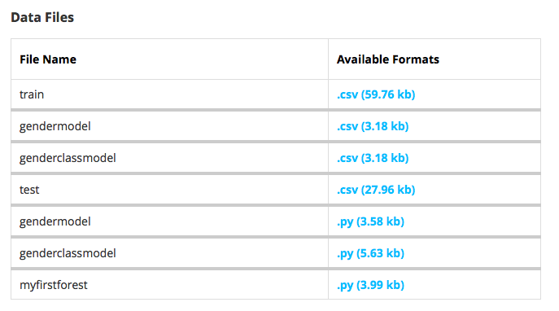
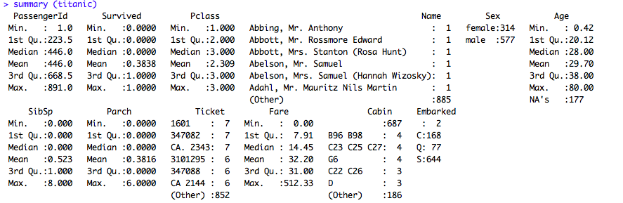
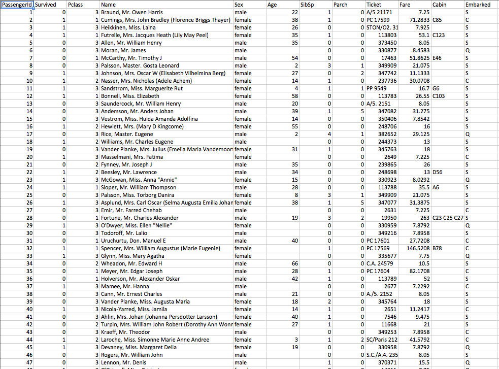

#**Technology Fundamentals for Analytics Lab**
##Jason Kuruzovich
---


#Agenda
1. Review Last time
2. R vs Python
3. Data preparation in Python 
4. Analysis with Python

----

##[iPython Notebook Viewer http://nbviewer.ipython.org](http://nbviewer.ipython.org)

##or from a command line: `ipython notebook` from directory containing notebooks

(To install necessary files /scripts/4_ipython.sh)

----
#Getting Started with Python
[Introduction to Unix](http://nbviewer.ipython.org/github/jkuruzovich/MGMT6963/blob/master/examples/0_Basic%20Unix%20Shell%20Commands%20for%20the%20Data%20Scientist.ipynb) 
[Introduction to Python](http://nbviewer.ipython.org/github/jkuruzovich/MGMT6963/blob/master/examples/1_Python%20Basics.ipynb) 
[Introduction to Python 2](http://nbviewer.ipython.org/github/jkuruzovich/MGMT6963/blob/master/examples/2_More%20on%20Python.ipynb) 
[Regular Expressions](http://nbviewer.ipython.org/github/jkuruzovich/MGMT6963/blob/master/examples/3_Regular%20Expressions.ipynb) 

----
# Unix Scripting can be a useful way of splitting, searching and preprocessing text files.

----
#Unix Scripting: Creating a new file 
We will talk about sending the output of one command to another below (“pipes”), but an important command-line operator is the “redirection” operator “>”. With “>” you can send the result of your command-line processing to a file. So if you’re using grep (described next) to find all the lines that contain “foo”, you can create a new file with just these lines using redirection:

`grep 'foo' orig_file.txt > new_file.txt`


----
#Unix Scripting: Grep
A utility for pattern matching. grep is by far the most useful unix utility. While grep is conceptually very simple, an effective developer or data scientist will no doubt find themselves using grep dozens of times a day. grep is typically called like this: 

`grep [options] [pattern] [files]`
`grep 'foo bar' sample.txt` #Match all in file 
`grep -v 'foo bar' sample.txt` #Inverse Matching
`grep -R 'hee haw' .`   #Recursive matching. Here grep descends sub folders.
                                

----
# *R vs Python - Some thoughts from around the web*
* "The main advantage of Python over R is that it's a real programming language in the C family. It scales easily, so it's conceivable that anything you have in your sandbox can be used in production."
* "I use both Python (for data analysis ofcourse including numpy and scipy) and R next to each other. However, I use R exclusively to perform data analysis, and Python for more generic programming tasks (e.g. workflow control of a computer model)."

----
# *R vs Python - Some thoughts from around the web*
* "Many of the commenters brought up the fact that R, while maybe not as fast (although that too is debatable) is much better for data analysis because of the huge number of libraries, tests, and its syntactical advantages (i.e. using formulas)."

----
# *iPython Notebooks*
* The IPython Notebook is a web-based interactive computational environment where you can combine code execution, text, mathematics, plots and rich media into a single document
* Use `ipython notebook` to launch
* (In the /scripts folder there is a script to install).

----
# *iPython - (1) Basics *
* The IPython Notebook

----
# *iPython - (2) More on Python *
* The IPython Notebook

----
# *iPython - (3) Regular Expressions *
* The IPython Notebook


----
#Assignment
Public solutions/tutorials to Kaggle problems can be tremendous opportunities to learn data science.  Try goggling "Kaggle tutorial" or "Kaggle Solutions" through Google and github. 

##Solution Assessment and Analysis. 
The goal of the first assignment is to understand solutions to analytics problems.  Overall, you should assess 3 total solutions:

----
##Solutions 1-2 should be for the Titanic, and you should be able to get a prediction for each.  You should compare differences in the solutions (in terms of performance) so both solutions must work.   You can choose from Python or R based solutions (and other languages with approval).

1. Overview of Titanic Analytics Problem and Data (1 page)
2. Solutions. Attempt to detail 2 detailed solutions  Include the source of the author, the analytical approach.  Provide an overview and include outcome in appendix.
3. Compare the predictive performance. 

----
##Solution 3: Open to whichever solution you choose.

4. Overview of Analytics Problem and Data (1 page)
5. Provide overview of solution/approach.
6. Prepare 3 minute presentation on solution. 

----
#Take some time and find at least 2 potential solutions to Kaggle problems [Post to Canvas->Pages->Google Doc]  


----
#Titanic: A Sample Case


----


---

#Cross Industry Standard Process for Data Mining (CRISP-DM; Shearer, 2000),

---
#Stages of Model Development 
*Pay attention we will use this as a framework*
1. Data understanding
2. Data preparation
3. Modeling
4. Evaluation
5. Deployment (DDD)
5. Business Understanding

----
#Titanic: Case Description
The sinking of the RMS Titanic is one of the most infamous shipwrecks in history.  On April 15, 1912, during her maiden voyage, the Titanic sank after colliding with an iceberg, killing 1502 out of 2224 passengers and crew. 

One of the reasons that the shipwreck led to such loss of life was that there were not enough lifeboats for the passengers and crew. Although there was some element of luck involved in surviving the sinking, some groups of people were more likely to survive than others, such as women, children, and the upper-class.

----

#[Kaggle Case  (https://www.kaggle.com/c/titanic-gettingStarted)](https://www.kaggle.com/c/titanic-gettingStarted)

----
#Titanic: Data Understanding


----


----
#What is the difference between the train and the test data?

----
#What variable are we trying to predict?

----
#What should be provided to Kaggle?

----
#What should be provided to Kaggle?
PassengerId,Survived
892,0
893,1
894,0
895,0
896,1
897,0
898,1
899,0
900,1
...
 
----
#Titanic: Data Understanding
VARIABLE DESCRIPTIONS:
PassengerId     Unique Identifier
survival        Survival  (0 = No; 1 = Yes)
pclass          Passenger Class (1 = 1st; 2 = 2nd; 3 = 3rd)
name            Name
sex             Sex
age             Age

----
#Titanic: Data Understanding (continued)
VARIABLE DESCRIPTIONS:
sibsp           Number of Siblings/Spouses Aboard
parch           Number of Parents/Children Aboard
ticket          Ticket Number
fare            Passenger Fare
cabin           Cabin
embarked        Port of Embarkation (C = Cherbourg; Q = Queenstown; S = Southampton)

----
#Titanic: Data Understanding (continued)
```{r}
titanic=read.csv(file="./data/titanic_train.csv",header=TRUE,sep=",")

str(titanic)
```

----


----
#Titanic: Data Understanding (continued)
```{r}
titanic=read.csv(file="./data/titanic_train.csv",header=TRUE,sep=",")

str(titanic)

summary(titanic)
```

----



----


----
# Titanic: Data Preparation
1. Deal with missing data.
###Missing data can limit the ability to generate prediction. While when doing *scientific analysis* you must be very cautious with data imputation, in prediction it is necessary. 

2. Recode data to create features.
###There are lots of ways that individual variables can be recoded to be used in different ways.  For example, is it better to include age as a number, or as a category (~18 may be very significant for boys with the "women and children first")

----

# Titanic: Data Preparation (1.  Missing Data)
There are a variety of models to impute data. Two simple ones are to replace with the median and to calculate the predicted value for the missing variable.


```{r}
#replace age with with the median
titanic.train$age[is.na(titanic.train$age)] <- median(titanic.train$age, na.rm=TRUE)


#predict age based on fare,gender, siblings using regression analysis
m.age <- lm(Age ~ Fare + Sex + SibSp, data = titanic.train)
titanic.train$Age[is.na(titanic.train$Age)] <- predict(m.age, newdata = titanic.train)[is.na(titanic.train$Age)]

#Use only whether individual is a child or not
titanic.train$Child <- 0
titanic.train$Child[train$Age < 18] <- 1

```


----

# Titanic: Data Preparation
Recode data to create features.

```{r}
train$title <- NA
train[grep('Mr[. ]', train$name), 12]       <- 'Mr'
train[grep('Don[. ]', train$name), 12]      <- 'Don'
train[grep('Dr[. ]', train$name), 12]       <- 'Dr'
train[grep('Major[. ]', train$name), 12]    <- 'Major'
train[grep('Jonkheer[. ]', train$name), 12] <- 'Jonkheer'
train[grep('Master[. ]', train$name), 12]   <- 'Master'
train[grep('Col[. ]', train$name), 12]      <- 'Col'
train[grep('Capt[. ]', train$name), 12]     <- 'Capt'
train[grep('Mrs[. ]', train$name), 12]      <- 'Mrs'
train[grep('Mme[. ]', train$name), 12]      <- 'Mme'
train[grep('Countess[. ]', train$name), 12] <- 'Countess'
train[grep('Ms[. ]', train$name), 12]       <- 'Ms'
train[grep('Miss[. ]', train$name), 12]     <- 'Miss'
train[grep('Mlle[. ]', train$name), 12]     <- 'Mlle'
train[grep('Rev[. ]', train$name), 12]      <- 'Rev'

```

----
# Titanic: Data Modeling and Evaluation
# What do you know about what is likely to drive survival in a shipwreck?

----
# Titanic: Data Modeling and Evaluation
1. Select data for cross valuation 
2. Determine the category of data model
3. Select and run the model 
4. Evaluate the performance 

----
#Titanic: Data Modeling and Evaluation (Cross Validation)
###Modeling optimizes the parameters to fit the training data as well as possible. If we then take an independent sample of validation data from the same population as the training data, it will generally turn out that the model does not fit the validation data as well as it fits the training data. This is called overfitting, and is particularly likely to happen when the size of the training data set is small, or when the number of parameters in the model is large. Cross-validation is a way to predict the fit of a model to a hypothetical validation set when an explicit validation set is not available. 
[Wikipedia](http://en.wikipedia.org/wiki/Cross-validation_)

----
#Titanic: Data Modeling and Evaluation (Cross Validation)
1. Holdout Sample (2-fold cross validation) (large datasets)
2. K-fold cross validation (large/medium datasets)
3. Leave P out cross validation (small datasets)


----

##Titanic: Data Modeling and Evaluation (Cross Validation - Holdout Sample/2-Fold)
###For each fold, we randomly assign data points to two sets d0 and d1, so that both sets are equal size (this is usually implemented by shuffling the data array and then splitting it in two). We then train on d0 and test on d1, followed by training on d1 and testing on d0.

----

##Titanic: Data Modeling and Evaluation (Cross Validation - K-fold cross validation)
###Original sample is randomly partitioned into k equal size subsamples. Of the k subsamples, a single subsample is retained as the validation data for testing the model, and the remaining k − 1 subsamples are used as training data. The cross-validation process is then repeated k times (the folds), with each of the k subsamples used exactly once as the validation data. The k results from the folds can then be averaged (or otherwise combined) to produce a single estimation. The advantage of this method over repeated random sub-sampling (see below) is that all observations are used for both training and validation, and each observation is used for validation exactly once. 10-fold cross-validation is commonly used, but in general k remains an unfixed parameter.
----

##Titanic: Data Modeling and Evaluation (Cross Validation - Leave P out cross validation )
###Leave-p-out cross-validation (LpO CV) involves using p observations as the validation set and the remaining observations as the training set. This is repeated on all ways to cut the original sample on a validation set of p' observations and a training set. LpO cross-validation requires to learn and validate C_n^p times (where n is the number of observation in the original sample). So as soon as n is quite big it becomes impossible to calculate.

----

# Titanic: Data Modeling and Evaluation
Determine the category of data model. We need a classifier. (This is just a sampling).
1. Simple prediction
2. Logistic Regression [only good for 2 categories]
3. Random Forest
	

----
# Titanic: Data Modeling and Evaluation
(python) This uses a simple loop. 

```{python}
# Finally, loop through each row in the train file, and look in column index [3] (which is 'Sex')
# Write out the PassengerId, and my prediction.

predictions_file = open("gendermodel.csv", "wb")
predictions_file_object = csv.writer(predictions_file)
predictions_file_object.writerow(["PassengerId", "Survived"])	# write the column headers
for row in test_file_object:									# For each row in test file,
    if row[3] == 'female':										# is it a female, if yes then
        predictions_file_object.writerow([row[0], "1"])			# write the PassengerId, and predict 1
    else:														# or else if male,
        predictions_file_object.writerow([row[0], "0"])			# write the PassengerId, and predict 0.
test_file.close()												# Close out the files.
predictions_file.close()

```

----
# Titanic: Data Modeling and Evaluation
Logistic Model

```{r}
logistic.model <- glm(survived ~ pclass + sex, family = binomial(), data=train)
 
#generate predictions for training data using the predict method of the logistic model
 training_predictions <- predict(logistic.model, type = "response")
 test_predictions[test_predictions >=0.5] <- 1
 test_predictions[ test_predictions != 1] <- 0
 test_predictions[is.na(test_predictions)] <- 0
 ```

----
# Titanic: Data Modeling and Evaluation
Random Forest

```{r}
train.rf <- randomForest(formula<-survived~pclass+sex+age_imp+sibsp+parch+fare+immature+noble+cabin_pos+cabin_floor+ticket_no+line, data=train)
print(train.rf)
train.rf$importance
varImpPlot(train.rf)
pred <- predict(train.rf, test)

```
	
----
#For each passenger in the test set, you must predict whether or not they survived the sinking ( 0 for deceased, 1 for survived ).  Your score is the percentage of passengers you correctly predict. What is an appropriate baseline for estimating performance?
	

----
#Random guess. A coin flip decides whether you pick if someone survives or not.
#How could we do better without building a model?
	
----
#Everyone dies.  Because only 38% of the people survive, we can beat a coin flip by predicting everyone dies.

----
#Two other good tutorials
[Python Tutorial](http://nbviewer.ipython.org/github/agconti/kaggle-titanic/blob/master/Titanic.ipynb)
[R Tutorial](http://trevorstephens.com/post/72920580937/titanic-getting-started-with-r-part-2-the)


