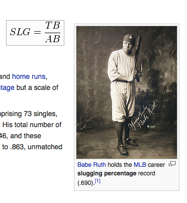

#**Technology Fundamentals for Analytics Lab**
##Jason Kuruzovich
---


#Agenda
1. Review Last time
2. R vs Python
2. Data preparation in Python 
3. Introduction to Models in Python and R
4. Introduction to Model Validation


---


---

#Cross Industry Standard Process for Data Mining (CRISP-DM; Shearer, 2000),

---
#Stages of Model Development 
*Pay attention we will use this as a framework*
1. Data understanding
2. Data preparation
3. Modeling
4. Evaluation
5. Deployment (DDD)
5. Business Understanding

----
#Titanic: A Sample Case


----
#Titanic: Case Description
The sinking of the RMS Titanic is one of the most infamous shipwrecks in history.  On April 15, 1912, during her maiden voyage, the Titanic sank after colliding with an iceberg, killing 1502 out of 2224 passengers and crew. 

One of the reasons that the shipwreck led to such loss of life was that there were not enough lifeboats for the passengers and crew. Although there was some element of luck involved in surviving the sinking, some groups of people were more likely to survive than others, such as women, children, and the upper-class.

----

#[Kaggle Case  (https://www.kaggle.com/c/titanic-gettingStarted)](https://www.kaggle.com/c/titanic-gettingStarted)

----
#Titanic: Data Understanding


----


----
#What is the difference between the train and the test data?

----
#What variable are we trying to predict?


----
#What should be provided to Kaggle?


----
#What should be provided to Kaggle?
PassengerId,Survived
892,0
893,1
894,0
895,0
896,1
897,0
898,1
899,0
900,1
...
 
----
#Titanic: Data Understanding
VARIABLE DESCRIPTIONS:
PassengerId     Unique Identifier
survival        Survival  (0 = No; 1 = Yes)
pclass          Passenger Class (1 = 1st; 2 = 2nd; 3 = 3rd)
name            Name
sex             Sex
age             Age

----
#Titanic: Data Understanding (continued)
VARIABLE DESCRIPTIONS:
sibsp           Number of Siblings/Spouses Aboard
parch           Number of Parents/Children Aboard
ticket          Ticket Number
fare            Passenger Fare
cabin           Cabin
embarked        Port of Embarkation (C = Cherbourg; Q = Queenstown; S = Southampton)

----
#Titanic: Data Understanding (continued)
```{r}
titanic=read.csv(file="./data/titanic_train.csv",header=TRUE,sep=",")

str(titanic)
```

----


----
#Titanic: Data Understanding (continued)
```{r}
titanic=read.csv(file="./data/titanic_train.csv",header=TRUE,sep=",")

str(titanic)

summary(titanic)
```

----


----


----
# Titanic: Data Preparation
1. Deal with missing data.
###Missing data can limit the ability to generate prediction. While when doing *scientific analysis* you must be very cautious with data imputation, in prediction it is necessary. 

2. Recode data to create features.
###There are lots of ways that individual variables can be recoded to be used in different ways.  For example, is it better to include age as a number, or as a category (~18 may be very significant for boys with the "women and children first")

----

# Titanic: Data Preparation (1.  Missing Data)
There are a variety of models to impute data. Two simple ones are to replace with the median and to calculate the predicted value for the missing variable.


```{r}
#replace age with with the median
titanic.train$age[is.na(titanic.train$age)] <- median(titanic.train$age, na.rm=TRUE)


#predict age based on fare,gender, siblings using regression analysis
m.age <- lm(Age ~ Fare + Sex + SibSp, data = titanic.train)
titanic.train$Age[is.na(titanic.train$Age)] <- predict(m.age, newdata = titanic.train)[is.na(titanic.train$Age)]

```


----

# Titanic: Data Preparation
Recode data to create features.

```{r}
train$title <- NA
train[grep('Mr[. ]', train$name), 12]       <- 'Mr'
train[grep('Don[. ]', train$name), 12]      <- 'Don'
train[grep('Dr[. ]', train$name), 12]       <- 'Dr'
train[grep('Major[. ]', train$name), 12]    <- 'Major'
train[grep('Jonkheer[. ]', train$name), 12] <- 'Jonkheer'
train[grep('Master[. ]', train$name), 12]   <- 'Master'
train[grep('Col[. ]', train$name), 12]      <- 'Col'
train[grep('Capt[. ]', train$name), 12]     <- 'Capt'
train[grep('Mrs[. ]', train$name), 12]      <- 'Mrs'
train[grep('Mme[. ]', train$name), 12]      <- 'Mme'
train[grep('Countess[. ]', train$name), 12] <- 'Countess'
train[grep('Ms[. ]', train$name), 12]       <- 'Ms'
train[grep('Miss[. ]', train$name), 12]     <- 'Miss'
train[grep('Mlle[. ]', train$name), 12]     <- 'Mlle'
train[grep('Rev[. ]', train$name), 12]      <- 'Rev'

```

----
# Titanic: Data Modeling and Evaluation
1. Select data for cross valuation 
2. Determine the category of data model
3. Select and run the model 
4. Evaluate the performance 

----
#Titanic: Data Modeling and Evaluation (Cross Validation)
###Modeling optimizes the parameters to fit the training data as well as possible. If we then take an independent sample of validation data from the same population as the training data, it will generally turn out that the model does not fit the validation data as well as it fits the training data. This is called overfitting, and is particularly likely to happen when the size of the training data set is small, or when the number of parameters in the model is large. Cross-validation is a way to predict the fit of a model to a hypothetical validation set when an explicit validation set is not available. 
[Wikipedia](http://en.wikipedia.org/wiki/Cross-validation_)

----
#Titanic: Data Modeling and Evaluation (Cross Validation)
1. Holdout Sample (2-fold cross validation) (large datasets)
2. K-fold cross validation (large/medium datasets)
3. Leave P out cross validation (small datasets)


----

##Titanic: Data Modeling and Evaluation (Cross Validation - Holdout Sample/2-Fold)
###For each fold, we randomly assign data points to two sets d0 and d1, so that both sets are equal size (this is usually implemented by shuffling the data array and then splitting it in two). We then train on d0 and test on d1, followed by training on d1 and testing on d0.

----

##Titanic: Data Modeling and Evaluation (Cross Validation - K-fold cross validation)
###Original sample is randomly partitioned into k equal size subsamples. Of the k subsamples, a single subsample is retained as the validation data for testing the model, and the remaining k − 1 subsamples are used as training data. The cross-validation process is then repeated k times (the folds), with each of the k subsamples used exactly once as the validation data. The k results from the folds can then be averaged (or otherwise combined) to produce a single estimation. The advantage of this method over repeated random sub-sampling (see below) is that all observations are used for both training and validation, and each observation is used for validation exactly once. 10-fold cross-validation is commonly used, but in general k remains an unfixed parameter.
----

##Titanic: Data Modeling and Evaluation (Cross Validation - Leave P out cross validation )
###Leave-p-out cross-validation (LpO CV) involves using p observations as the validation set and the remaining observations as the training set. This is repeated on all ways to cut the original sample on a validation set of p' observations and a training set. LpO cross-validation requires to learn and validate C_n^p times (where n is the number of observation in the original sample). So as soon as n is quite big it becomes impossible to calculate.

----

# Titanic: Data Modeling and Evaluation
Determine the category of data model. We need a classifier. (This is just a sampling).
1. Simple prediction
2. Logistic Regression [only good for 2 categories]
3. Random Forest
	

----
# Titanic: Data Modeling and Evaluation
(python) This uses a simple loop. 

```{python}
# Finally, loop through each row in the train file, and look in column index [3] (which is 'Sex')
# Write out the PassengerId, and my prediction.

predictions_file = open("gendermodel.csv", "wb")
predictions_file_object = csv.writer(predictions_file)
predictions_file_object.writerow(["PassengerId", "Survived"])	# write the column headers
for row in test_file_object:									# For each row in test file,
    if row[3] == 'female':										# is it a female, if yes then
        predictions_file_object.writerow([row[0], "1"])			# write the PassengerId, and predict 1
    else:														# or else if male,
        predictions_file_object.writerow([row[0], "0"])			# write the PassengerId, and predict 0.
test_file.close()												# Close out the files.
predictions_file.close()

```

----
# Titanic: Data Modeling and Evaluation
Random Forest
```{r}
logistic.model <- glm(survived ~ pclass + sex, family = binomial(), data=train)
 
#generate predictions for training data using the predict method of the logistic model
 training_predictions <- predict(logistic.model, type = "response")
 test_predictions[test_predictions >=0.5] <- 1
 test_predictions[ test_predictions != 1] <- 0
 test_predictions[is.na(test_predictions)] <- 0
 ```
----
# Titanic: Data Modeling and Evaluation
Random Forest
```{r}
train.rf <- randomForest(formula<-survived~pclass+sex+age_imp+sibsp+parch+fare+immature+noble+cabin_pos+cabin_floor+ticket_no+line, data=train)
print(train.rf)
train.rf$importance
varImpPlot(train.rf)
pred <- predict(train.rf, test)

```
	

----
# Titanic: Data Modeling (Determine the category)
1. Determine the category of data model
2. Assess the performance on the training set

----

# Unix Scripting can be a useful way of splitting, searching and preprocessing text files.

----
#Unix Scripting: Creating a new file 
We will talk about sending the output of one command to another below (“pipes”), but an important command-line operator is the “redirection” operator “>”. With “>” you can send the result of your command-line processing to a file. So if you’re using grep (described next) to find all the lines that contain “foo”, you can create a new file with just these lines using redirection:

`grep 'foo' orig_file.txt > new_file.txt`


----
#Unix Scripting: Grep
A utility for pattern matching. grep is by far the most useful unix utility. While grep is conceptually very simple, an effective developer or data scientist will no doubt find themselves using grep dozens of times a day. grep is typically called like this: 

`grep [options] [pattern] [files]`
`grep 'foo bar' sample.txt` #Match all in file 
`grep -v 'foo bar' sample.txt` #Inverse Matching
`grep -R 'hee haw' .`   #Recursive matching. Here grep descends sub folders.
                                

----
# *R vs Python - Some thoughts from around the web*
* "The main advantage of Python over R is that it's a real programming language in the C family. It scales easily, so it's conceivable that anything you have in your sandbox can be used in production."
* "I use both Python (for data analysis ofcourse including numpy and scipy) and R next to each other. However, I use R exclusively to perform data analysis, and Python for more generic programming tasks (e.g. workflow control of a computer model)."

----
# *R vs Python - Some thoughts from around the web*
* "Many of the commenters brought up the fact that R, while maybe not as fast (although that too is debatable) is much better for data analysis because of the huge number of libraries, tests, and its syntactical advantages (i.e. using formulas)."
* "
----
# *iPython Notebooks*
* The IPython Notebook is a web-based interactive computational environment where you can combine code execution, text, mathematics, plots and rich media into a single document
* Use `ipython notebook` to launch
* (In the /scripts folder there is a script to install).

----
# *iPython - (1) Basics *
* The IPython Notebook

----
# *iPython - (2) More on Python *
* The IPython Notebook

----
# *iPython - (3) Regular Expressions *
* The IPython Notebook

----
# *iPython - (4) Introduction to Data Mining with Python *
* The IPython Notebook

----

----

# *This Time - Basic Data Preparation in Python*

----
#Data Preparation in Python?
* Meaning: What is the definition of the data?  How can we understand what it means?
* Data types: What is the data structure? 
* Provenance: What has the history of the data been?
* Distribution: Mean, Standard Deviation, Correlations, Skewness, Entropy

----
# *Introduction to Models and Validation*

----
#Data Preparation in Python?
* Meaning: What is the definition of the data?  How can we understand what it means?
* Data types: What is the data structure? 
* Provenance: What has the history of the data been?
* Distribution: Mean, Standard Deviation, Correlations, Skewness, Entropy

----
#Data Types - Variables
* Binary: Of two different categories. 
* Nominal: Specific categories of data that don't have a natural ordering. Model of vehicle.
* Ordinal: Categories of data that have a natural ordering.  `Education (high school, Undergrad, Masters, PhD)`
* Interval: Natural split between the levels `Satisfation (Rate on a scale of 1-10 how satisfied you are.)`
* Ratio: Intervale data with a natural 0 point. 


----
#[Correlations](http://www.tylervigen.com)


----
##"Entropy is a measure of disorder that can be applied to a set, such as one of our individual segments. Consider that we have a set of properties of members of the set, and each member has one and only one of the properties. ... Disorder corresponds to how mixed (impure) the segment is with respect to these properties of interest. So, for example, a mixed up segment with lots of write-offs and lots of non-write-offs would have high entropy."

```entropy = - p1 log (p1) - p2 log (p2) - ⋯
```

----

##How do we understand the entropy among the *intelligent species* in the room?

----
#What would happen to any model predicting whether someone in the room is an alien.  


----
#Why is this relevant to creating a model?

----

#How would predicting a man vs. a woman be different?


----

#Among undergrads, is gender entropy higher or lower or same when comparing RPI vs. Harvard?


----
# *Data preparation*


----
# What do we need to *prepare* the *data?*

----
# *Data preparation*
* Cleaning: Are there incomplete records that should be removed or data inferred? 
* Feature Creation: Are there ways that data can be coded or processed to get more value?
* Merging Datasets: Often it is necessary to merge datasets based on a key. 
* Provenance: What has the history of the data been?
* Leakage: Beware of data "leaks"

----
#*Feature Creation* is when data is combined or process in such a way to provide it with alternative meaning.

----
 

----
#Slugging percentage is a feature created from the raw data

----

#*Data Leakage* is when data collected in the historical data gives *information on the target variable.*

----
#*Data Leakage Example.* 
We want to predict total spend for an online shopper and find that the amount of tax paid is a great predictor of total spend.

Is this a problem?  If so why?
 
---
#*Data Modeling*


----
#What do we need to *model* the *data?*

----

# *Data Modeling*
* Data: Selected and valid dataset.
* Objective: Clear business insight into what we are trying to do. 
* Model Type: Understanding of type of model.
* Algorithm: Specific method of modeling data

----
#Types of Models
1. Classification
2. Regression
3. Similarity
4. Clustering
5. Co-occurence grouping
6. Profiling
7. Link prediction
8. Data reduction
9. Causal modeling

----
#*Evaluation*

----
# *Evaluation*
* Training set outcome: How well does the model predict for the training set.
* Testing prediction: How well does the model predict for a dataset "not" trained.
* Insights: Can I gain specific insights from the data

----
# *Evaluation*
* Comparison: How does prediction compare to other models? To a random prediction?
* Effect Size: In metrics that really matter (not p values) have can we understand identified relationships.


---
#Note two different potential outcomes *Deployment* and *Business Understanding*. What do we mean by each?

---

#What is *Deployment* likely to mean in this case?

---
# *Deployment*
* Employing mechanisms associated with DDD to implement algorithms in business process.
* Provide tools/training for repeated use of models by analysts

---
#What is *Business Understanding* likely to mean in this case?


---
# *Business Understanding*
* Associations of variables.
* Types of customers and associated behaviors

---
#Intro to R


